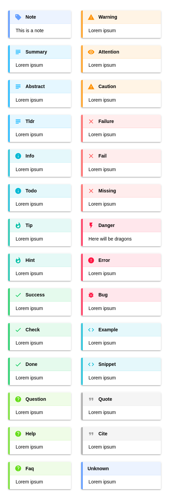

# markdown-it-admon

> Plugin for creating admonitions for [markdown-it](https://github.com/markdown-it/markdown-it) markdown parser.

With this plugin you can create admonitions like:

```
!!! warning
    *here be dragons*

```

Markdown syntax follows [python-markdown][].

[rST][] suggests the following "types": `attention`, `caution`, `danger`, `error`, `hint`, `important`, `note`, `tip`, and `warning`; however, you’re free to use whatever you want.

A styles file does support the following admonition types: Credits go to [vscode-markdown-extended][].

```
'note',
'summary', 'abstract', 'tldr',
'info', 'todo',
'tip', 'hint',
'success', 'check', 'done',
'question', 'help', 'faq',
'warning', 'attention', 'caution',
'failure', 'fail', 'missing',
'danger', 'error', 'bug',
'example', 'snippet',
'quote', 'cite'
```



## Installation

node.js:

```bash
$ npm install markdown-it-admon --save
```


## API

```js
const md = require('markdown-it')()
             .use(require('markdown-it-admon') [, options]);
```

Params:

- __name__ - container name (mandatory)
- __options?:__
  - __render__ - optional, renderer function for opening/closing tokens.


## License

[MIT](./LICENSE)


## References

<!-- !ref -->

* [python-markdown][python-markdown]
* [rST][rST]
* [vscode-markdown-extended][vscode-markdown-extended]

<!-- ref! -->

[python-markdown]: https://python-markdown.github.io/extensions/admonition/

[rST]: https://docutils.sourceforge.io/docs/ref/rst/directives.html#specific-admonitions

[vscode-markdown-extended]: https://github.com/qjebbs/vscode-markdown-extended
